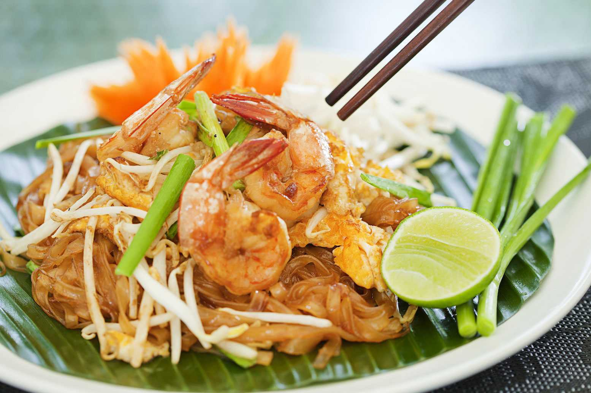

<!DOCTYPE html>
<html lang="ja">
<head>
    <meta charset="UTF-8">
    <meta name="viewport" content="width=device-width, initial-scale=1.0">
    <title>バンコク旅行プレゼンテーション</title>
    
</head>
<body>

<header>
    <h1>バンコクを探検しよう</h1>
    
タイの心臓部へようこそ

</header>

<nav>
    <a href="#introduction">紹介</a>
    <a href="#attractions">観光名所</a>
    <a href="#food">食文化</a>
    <a href="#tips">旅行のヒント</a>
</nav>

</section>

<section id="introduction" class="container">
    

    
    <h2>紹介</h2>
    
バンコクはタイの首都であり、伝統と現代が融合した都市です。活気あるストリートライフ、アイコニックな寺院、美味しい食べ物で知られています。観光客にとって忘れられない体験を提供します。

</section>

<section id="attractions" class="container">
    <h2>観光名所</h2>
    

        

            
            <h3>ワット・プラケオ (エメラルド寺院)</h3>
            
タイの象徴であるエメラルド仏像を所蔵する歴史的な寺院。

        

        

            
            <h3>ワット・アルン (暁の寺)</h3>
            
チャオプラヤ川のほとりに位置する美しい寺院。日の出や日没時が最適。

        

        

            
            <h3>チャトチャック週末市場</h3>
            
世界最大級の市場で、15,000以上の屋台が並びます。

        

    

</section>

<section id="food" class="container">
    <h2>バンコクの食文化</h2>
    

        

            
	    <h3>トムヤム</h3>
            
            <h4>パッタイ</h4>
            
	    <h5>カパオ</h5>
	    
	    <h5>グリーンカレー</h5>
            

        

        

            
　　　　　　 <h3>シロッコ・スカイバー</h3>
            
            <h3>ムーンバー</h3>
            
            <h3>スカイバー</h3>
            
            <h3>スリーシックスティーミレニアム</h3>

            

        

    

</section>

<section id="tips" class="container">
    <h2>旅行のヒント</h2>
    <ul>
        <li><strong>おすすめの訪問時期:</strong> 11月から2月 (涼しくて乾燥した季節)。</li>
        <li><strong>交通手段:</strong> BTSスカイトレイン、MRT地下鉄、またはトゥクトゥクで移動。</li>

    </ul>
</section>

<footer>
    
今日からバンコクの旅を計画しましょう！

</footer>

</body>
</html>
